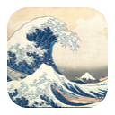

# Flow

**Free · Built by [Marco Polo Research Lab](https://mprlab.com/)**

Flow is a local macOS application in the menu bar.
It provides work periods, pause reminders, resume notes, and a daily history summary.
All product timers use real elapsed time.



## Local Development

Clone the repository before you open Xcode.

```bash
git clone https://github.com/tyemirov/Rhythm.git
cd Rhythm
```
The application requires macOS 13 or later and Xcode 15 or later.
Validation used Xcode 27.0 and macOS 26.6.2.
The project uses ad-hoc signing for local execution.
It requires no external packages or developer account.

1. Open the repository folder in Xcode.
2. Select the `Flow` scheme.
3. Select `My Mac` as the destination.
4. Press `Command-R`.
5. Open the Flow icon in the menu bar.
6. Select `Start wave`.

Use `Command-U` to execute the tests in the same scheme.
You can also open `Flow.xcodeproj` directly.

The application has no Dock icon.
The first application start opens the popover.
Ready shows the `water.waves` system symbol in the menu bar.
An active Wave shows the same symbol inside a filled circle.
Pause shows pause bars.
The application views show the Great Wave image in color.
Playback controls use play, pause, and restart symbols.
Tooltips and accessibility labels identify each action.

## Local Commands

Execute these commands from the repository root.

| Command | Result |
| --- | --- |
| `make build` | Build the application for local use. |
| `make run` | Build and open the application. |
| `make icons` | Generate the Great Wave icon assets from the retained artwork. |
| `make test` | Execute headless core and persistence tests. |
| `make test-ui` | Execute native tests of lab links, menu bar icons, and navigation. |
| `make lint` | Do a check of project metadata and Git whitespace. |
| `make governance` | Do a check of Governor file consistency. |
| `make docs-check` | Verify the official language reference and check technical prose. |
| `make ci` | Execute all local repository checks. |

Build output stays in the ignored `.build/` directory.
`make ci` is a local command. It does not publish the application.
The Governor commands use the installed skill under `~/.codex/skills/mprlab-governor`.
Set `GOVERNOR_SKILL` when that installation path differs.

## Run Without Xcode

The built application runs independently of Xcode.
Xcode build tools are necessary only to build the source.

Execute these commands from the repository root:

```bash
make build
mkdir -p "$HOME/Applications"
ditto .build/Xcode/Build/Products/Debug/Flow.app "$HOME/Applications/Flow.app"
```

Open `~/Applications/Flow.app` through Finder or Spotlight.
The application appears in the menu bar.
After source changes, build the application and repeat the copy.

## Daily Use

| Elapsed work | Application behavior |
| --- | --- |
| 0–60 minutes | Quiet work with elapsed time in the popover. |
| 60 minutes | One notification and an optional chime: `A pause is available` |
| 90 minutes | A separate window: `Time for a pause` |
| 120 minutes | One overrun window: `This wave has run long` |

1. Select `Pause` to show the resume note field.
2. Enter a note if needed, then select `Begin pause`.
3. When you return, read the resume note.
4. Select the play control, `Continue`, to continue the same Wave.
5. Open `Today’s waves` to see completed waves and pauses.
6. Select `More from the lab` below History to find other lab projects.
7. Select `Quit Flow` in Settings to close the application.

The lab page includes Gravity Notes, Countdown Calendar, and Hecate.
Each project link opens its website in your default browser.
Select `Explore all projects` to open the full lab catalog.
Settings also contains `About Flow & the lab`.
Back returns to the page from which you opened the lab page.

The suggested pause is five minutes.
Every third completed wave that day has a suggested fifteen-minute pause.
The application starts work only after you select `Continue` or `Restart wave`.
One five-minute defer is available through minute 115.
You can close the pause reminder or select `Keep working`.

## Notifications And Focus

1. Open the gear button in the popover.
2. Select `Enable reminders`.
3. Accept the macOS notification prompt.
4. If permission is disabled, enable Flow under `System Settings → Notifications`.
5. To receive reminders during Focus, add Flow to the selected Focus allowed-app list.

The 90-minute and 120-minute windows operate independently of notification permission.
The Focus preference uses a manual service.
It does not change macOS Focus automatically.
Use `Control Center → Focus` to change Focus when you start or pause work.

## Repository Map

| Path | Responsibility |
| --- | --- |
| `Flow/` | Application source and icon assets. |
| `Flow/Core/` | State transitions, timing rules, and history. |
| `Flow/Services/` | Notifications, Focus, input activity, and local storage. |
| `Flow/Views/` | Native SwiftUI views. |
| `FlowTests/` | Core tests. |
| `Flow.xcodeproj/` | Application, XCTest target, and shared Flow scheme. |
| `.mprlab/` | Policy, planning rules, terminology, and issue records. |
| `docs/` | Architecture and validation records. |

[Architecture](docs/ARCHITECTURE.md) describes service boundaries and saved data.
[Validation](docs/VALIDATION.md) records completed checks and their limits.

## Product Terms

Flow is the application and the overall pattern of work and rest.
A Wave is a work period.
You can pause a Wave and continue it later.
A pause is a rest period within or between waves.
`Today’s waves` shows the daily history.
`Where to pick up` labels the resume note field.

`Pause` opens the note field while the wave continues.
`Begin pause` stops the work timer and starts Pause time.
`Continue` starts work again at the saved Wave duration.
`Restart wave` starts a new Wave at zero and keeps the previous time in History.
The restart control is available during work and Pause.

The Pause display shows both the saved Wave time and the current Pause time.
Pause time does not increase Wave time.

## License And Distribution

Marco Polo Research Lab provides Flow under the [MIT license](LICENSE).
The repository contains the source code and the local Xcode project.
The application is not yet available through the Mac App Store.
[Mac App Store preparation](docs/MAC_APP_STORE.md) records the required work and account decisions.
